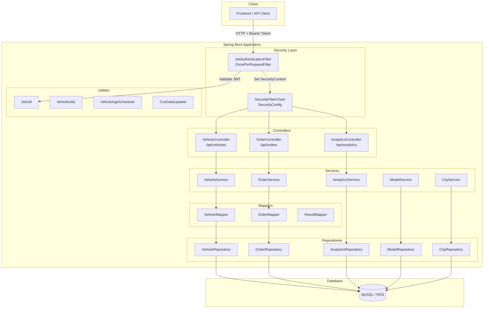
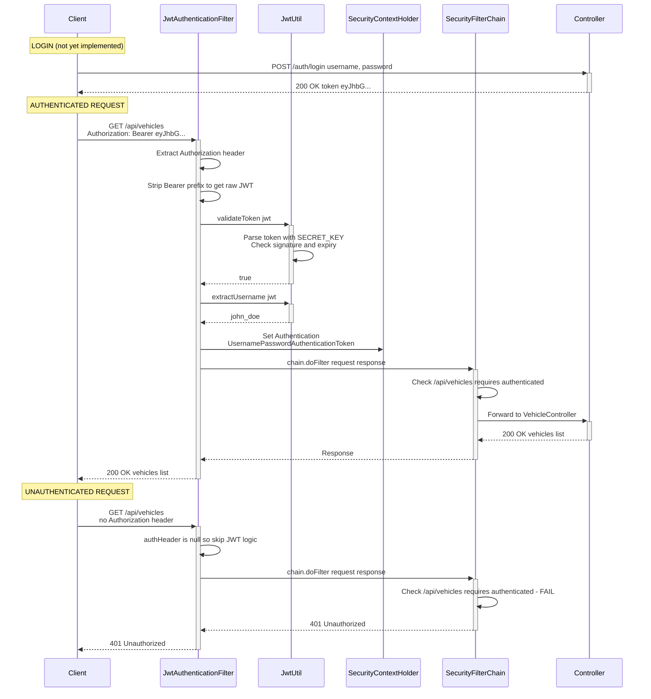
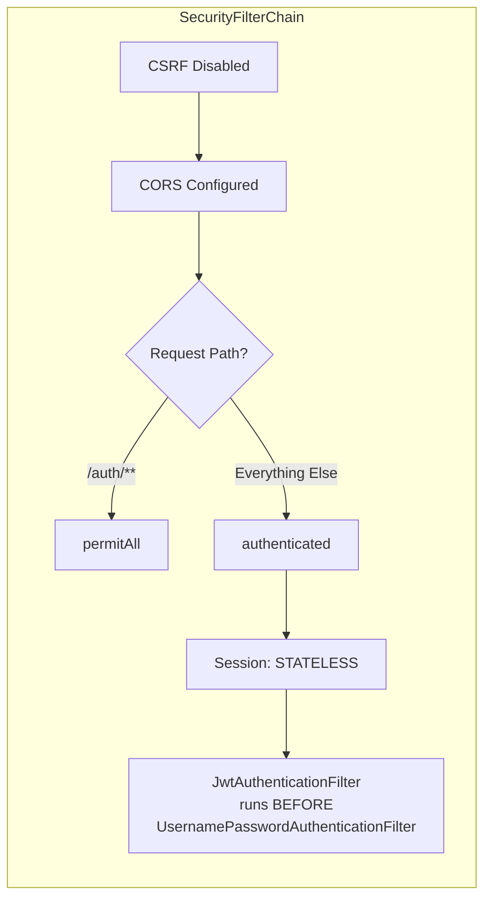
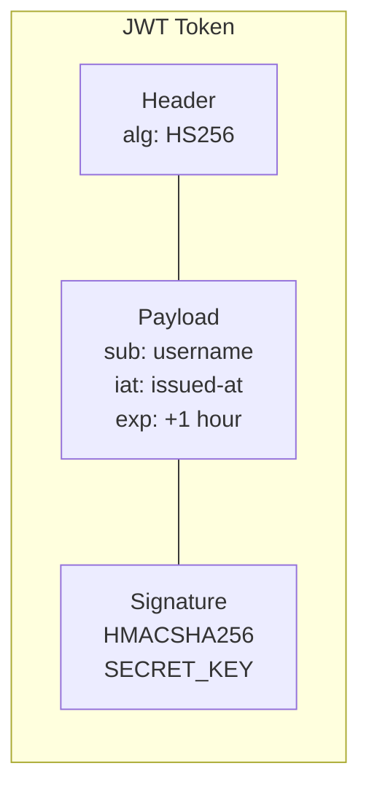
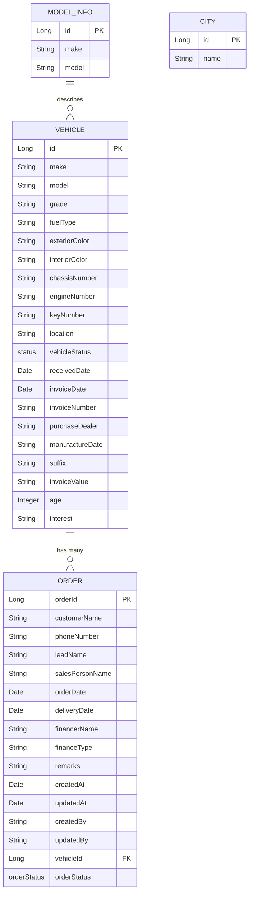

# Fleet Manager — Architecture & Security Plan

## Table of Contents
1. [Project Overview](#project-overview)
2. [Architecture Diagram](#architecture-diagram)
3. [JWT & Spring Security Flow](#jwt--spring-security-flow)
4. [API Endpoint Map](#api-endpoint-map)
5. [Entity Relationship Diagram](#entity-relationship-diagram)
6. [Project Structure](#project-structure)
7. [Tech Stack](#tech-stack)
8. [What's Implemented](#whats-implemented)
9. [What's Missing / TODO](#whats-missing--todo)

---

## Project Overview

Fleet Manager is a Spring Boot REST API for managing vehicle inventory, orders, and sales analytics. It uses JWT-based stateless authentication via Spring Security.

---

## Architecture Diagram



---

## JWT & Spring Security Flow

### Authentication Sequence



### Security Configuration Summary



### JWT Token Structure



| Property        | Value                              |
|-----------------|------------------------------------|
| Algorithm       | HS256 (HMAC-SHA256)                |
| Secret Key      | Hard-coded in `JwtUtil`            |
| Expiration      | 1 hour                             |
| Subject (sub)   | Username                           |
| Library         | jjwt 0.11.5                        |

---

## API Endpoint Map

### Public (No Auth Required)
| Method | Endpoint       | Description                   |
|--------|----------------|-------------------------------|
| *      | `/auth/**`     | Auth endpoints (TODO)         |

### Protected (JWT Required)

#### Vehicles (`/api/vehicles`)
| Method | Endpoint                              | Description                          |
|--------|---------------------------------------|--------------------------------------|
| GET    | `/api/vehicles`                       | Get all vehicles                     |
| GET    | `/api/vehicles/{id}`                  | Get vehicle by ID                    |
| GET    | `/api/vehicles/getUniqueVehicles`     | Get unique vehicles with age counts  |
| GET    | `/api/vehicles/ageCountByModel`       | Age count grouped by model           |
| GET    | `/api/vehicles/vehiclesAndOrderDetailsByModel?model=X` | Vehicle + order details by model |
| GET    | `/api/vehicles/model-info`            | Get all model info                   |
| POST   | `/api/vehicles`                       | Create a vehicle                     |
| POST   | `/api/vehicles/upload`                | Upload CSV file                      |
| PUT    | `/api/vehicles/{id}`                  | Update a vehicle                     |
| DELETE | `/api/vehicles/{id}`                  | Delete a vehicle                     |

#### Orders (`/api/orders`)
| Method | Endpoint                    | Description               |
|--------|-----------------------------|---------------------------|
| GET    | `/api/orders`               | Get all orders            |
| GET    | `/api/orders/{id}`          | Get order by ID           |
| GET    | `/api/orders/vehicle/{id}`  | Get orders by vehicle ID  |
| POST   | `/api/orders`               | Create an order           |
| PUT    | `/api/orders/{id}`          | Update an order           |
| DELETE | `/api/orders/delete/{id}`   | Delete an order           |

#### Analytics (`/api/analytics`)
| Method | Endpoint                        | Description                |
|--------|---------------------------------|----------------------------|
| POST   | `/api/analytics/monthly-sales`  | Monthly sales report       |
| GET    | `/api/analytics/top-model-sold` | Top model sold             |

---

## Entity Relationship Diagram



### Enums

| Enum          | Values                                         |
|---------------|-------------------------------------------------|
| `status`      | BOOKED, AVAILABLE, SOLD, IN_TRANSIT, FREE       |
| `orderStatus` | ACTIVE, INACTIVE, PENDING, DELIVERED             |

---

## Project Structure

```
src/main/java/com/inventory/fleet_manager/
├── FleetManagerApplication.java          # Main entry point
├── configuration/
│   ├── SecurityConfig.java               # Spring Security filter chain
│   ├── JwtAuthenticationFilter.java      # JWT servlet filter
│   ├── JwtUtil.java                      # JWT generate/validate/extract
│   ├── CorsProperties.java              # CORS allowed origins from config
│   ├── DatasourceProperties.java         # Datasource config
│   ├── DataSourceShutdownHook.java       # Graceful DB shutdown
│   ├── ProfileConfig.java               # Profile-based config
│   └── SecretsManagerConfig.java         # AWS Secrets Manager integration
├── controller/
│   ├── VehicleController.java            # /api/vehicles endpoints
│   ├── OrderController.java              # /api/orders endpoints
│   └── AnalyticsController.java          # /api/analytics endpoints
├── service/
│   ├── VehicleService.java               # Vehicle business logic
│   ├── OrderService.java                 # Order business logic
│   ├── AnalyticsService.java             # Analytics business logic
│   ├── ModelService.java                 # Model info service
│   └── CityService.java                 # City service
├── model/
│   ├── Vehicle.java                      # Vehicle JPA entity
│   ├── Order.java                        # Order JPA entity
│   ├── ModelInfo.java                    # Model info JPA entity
│   └── City.java                         # City JPA entity
├── dto/
│   ├── VehicleDTO.java
│   ├── OrderDTO.java
│   ├── ModelInfoDTO.java
│   ├── VehicleOrderResponse.java
│   ├── AnalyticsResponse.java
│   ├── MonthlySalesRequest.java
│   ├── MonthlySalesResponse.java
│   └── ...
├── mapper/
│   ├── VehicleMapper.java                # Vehicle <-> VehicleDTO
│   ├── OrderMapper.java                  # Order <-> OrderDTO
│   └── ResultMapper.java
├── repository/
│   ├── VehicleRepository.java
│   ├── OrderRepository.java
│   ├── AnalyticsRepository.java
│   ├── ModelRepository.java
│   └── CityRepository.java
├── enums/
│   ├── status.java                       # BOOKED, AVAILABLE, SOLD, ...
│   └── orderStatus.java                  # ACTIVE, INACTIVE, PENDING, DELIVERED
├── exception/
│   ├── GlobalExceptionHandler.java       # @ControllerAdvice
│   └── VehicleNotFoundException.java
└── utility/
    ├── VehicleUtils.java                 # Age calculation helpers
    ├── VehicleAgeScheduler.java          # Scheduled age updates
    └── CsvDataUpdater.java              # CSV bulk data updater
```

---

## Tech Stack

| Layer          | Technology                          |
|----------------|-------------------------------------|
| Framework      | Spring Boot                         |
| Security       | Spring Security + JWT (jjwt 0.11.5) |
| ORM            | Spring Data JPA / Hibernate         |
| Database       | MySQL (AWS RDS in prod)             |
| Mapping        | MapStruct 1.5.5                     |
| Build          | Maven, Java 17                      |
| Secrets        | AWS Secrets Manager                 |
| Other          | Lombok, OpenCSV, Apache POI         |

---

## What's Implemented

- [x] **JwtUtil** — Token generation (HS256, 1hr expiry), validation, username extraction
- [x] **JwtAuthenticationFilter** — Intercepts requests, validates Bearer token, sets SecurityContext
- [x] **SecurityConfig** — Stateless sessions, CSRF disabled, CORS configured, `/auth/**` public, all else protected
- [x] **BCryptPasswordEncoder** bean — Ready for password hashing
- [x] **AuthenticationManager** bean — Ready for login flow
- [x] Vehicle CRUD + CSV upload + analytics
- [x] Order CRUD + vehicle-order linking
- [x] Analytics (monthly sales, top model sold)
- [x] Global exception handling

---

## What's Missing / TODO

- [ ] **AuthController** — No `/auth/login` or `/auth/register` endpoints exist yet; `JwtUtil.generateToken()` is defined but never called
- [ ] **User entity and repository** — No user model to store credentials
- [ ] **UserDetailsService** — No implementation to load users for Spring Security
- [ ] **Role-based authorization** — Filter sets empty authorities `new ArrayList<>()`; no `@PreAuthorize` or role checks
- [ ] **Externalize secret key** — Currently hard-coded in both `JwtUtil` and `JwtAuthenticationFilter` (duplicated)
- [ ] **Refresh token mechanism** — Only access tokens with 1hr expiry; no refresh flow
- [ ] **Token blacklisting/logout** — No way to invalidate tokens before expiry
